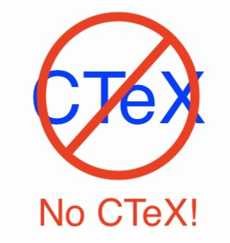
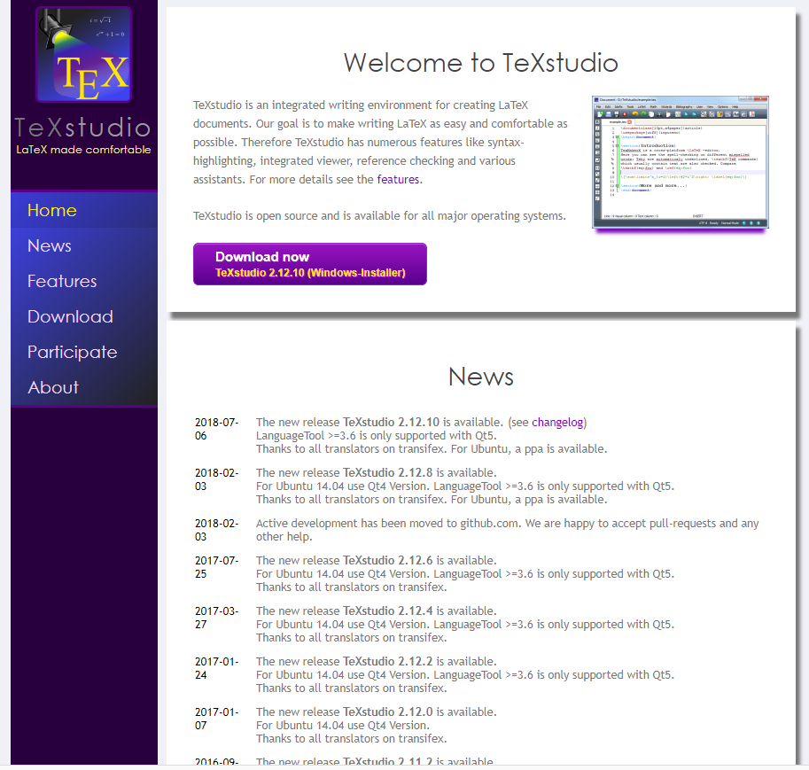
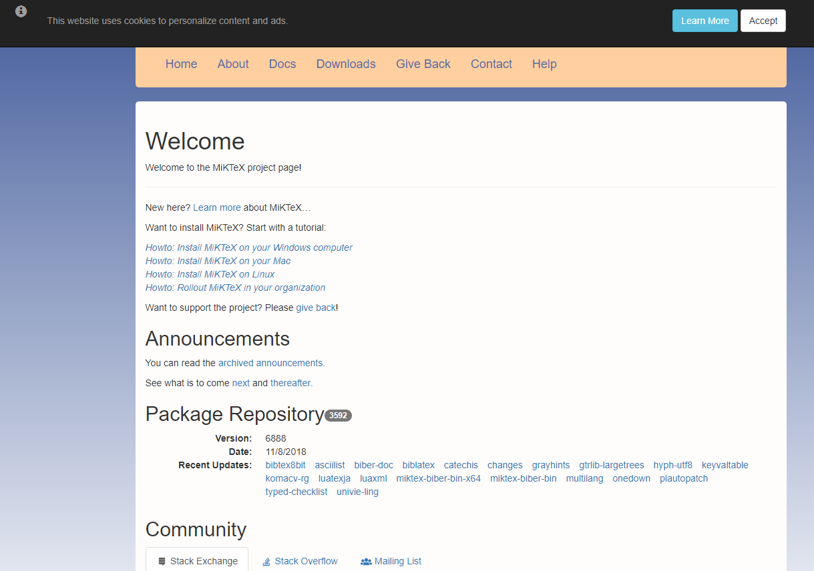
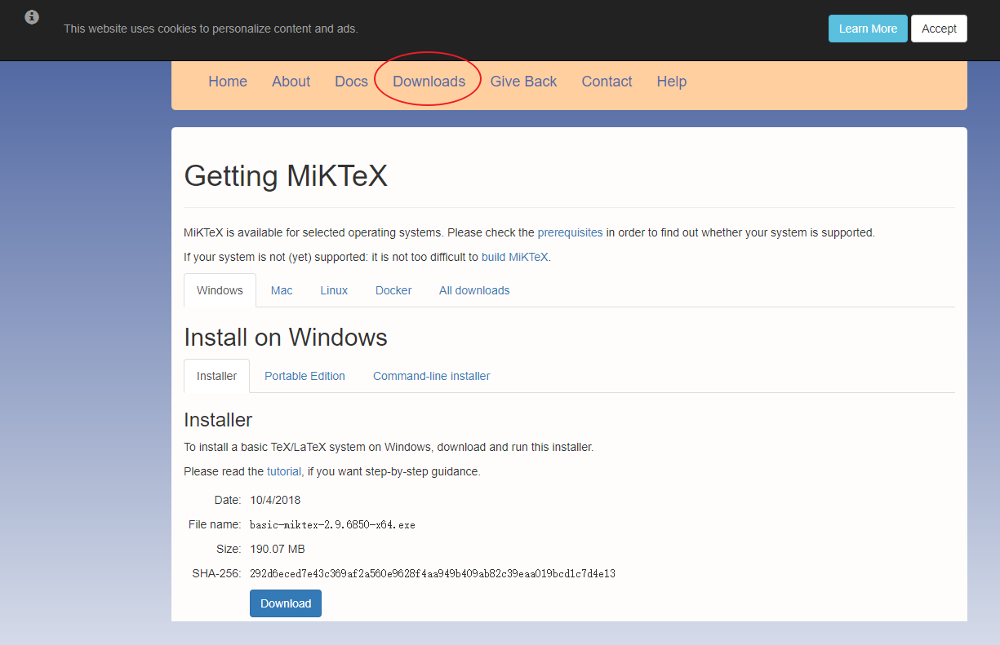

<!-- TOC depthFrom:1 depthTo:6 withLinks:1 updateOnSave:1 orderedList:0 -->

- [环境安装之Windows](#环境安装之windows)
	- [快速入门](#快速入门)
	- [废话详解](#废话详解)
		- [前台编辑器用TexStudio](#前台编辑器用texstudio)
		- [后台编译用MikTex](#后台编译用miktex)

<!-- /TOC -->
# 环境安装之Windows

## 快速入门

1. 安装MiKTeX套装，官网下载，安装方法下一步下一步即可
（<http://miktex.org/>）
2. 安装TeXstudio，官网下载，安装方法下一步下一步即可(**拒绝安装路径带中文**)（<http://texstudio.sourceforge.net/>）
3. 开启TexStudio搞事情玩起~

## 废话详解

* Windows平台上一般有3个选择：TeXLive，MiKTeX，CTex。
* **对于CTex，极度不建议**。如果您的电脑上装有旧版CTeX套装，建议先卸载它。因为它很久不更新了，会造成很多奇怪的问题。卸载前建议手工备份环境变量Path，因为某些版本CTex的bug可能导致Path清空或被覆盖。

* 如果选用TeXLive，MiKTeX，他们都自带了Texworks作为前端Tex编辑器，其功能可供使用，但稍显简陋（约等于记事本加上几个编译按钮）。
* 因此，你可以另行安装一个适用于LaTeX的文本编辑器，例如TeXstudio、TexMaker等。

### 前台编辑器用TexStudio

墙裂推荐安装TeXstudio（<http://texstudio.sourceforge.net/>）作为前端编辑器，其功能更加友好易用，且仍在维护和更新。

### 后台编译用MikTex

毫无疑问，download里面找适合自己平台的安装包，下载，安装方法下一步下一步即可(**拒绝安装路径带中文**
